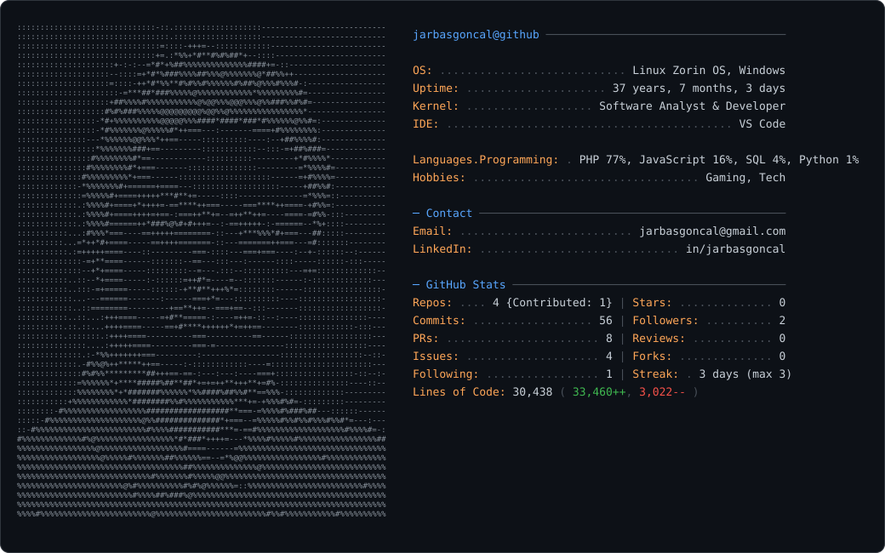

<picture>
  <source media="(prefers-color-scheme: dark)" srcset="dark_mode.svg" />
  <source media="(prefers-color-scheme: light)" srcset="light_mode.svg" />
  
</picture>

- 👋 Olá, sou @jarbasgoncal
- 👀 Estou interessado em aprender e compartilhar conhecimento na area de desenvolvimento desktop.
- 📚 Em constante aprendizado.
- 💡 Tenho conhecimento em SQL, Python, C#, JS.
- 🤝 Estou disposto a colaborar em projetos novos e ajudar com o que eu puder.
